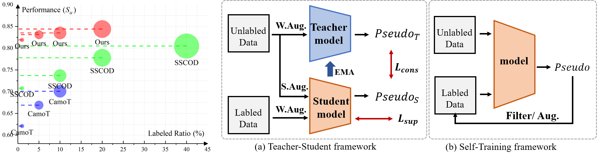
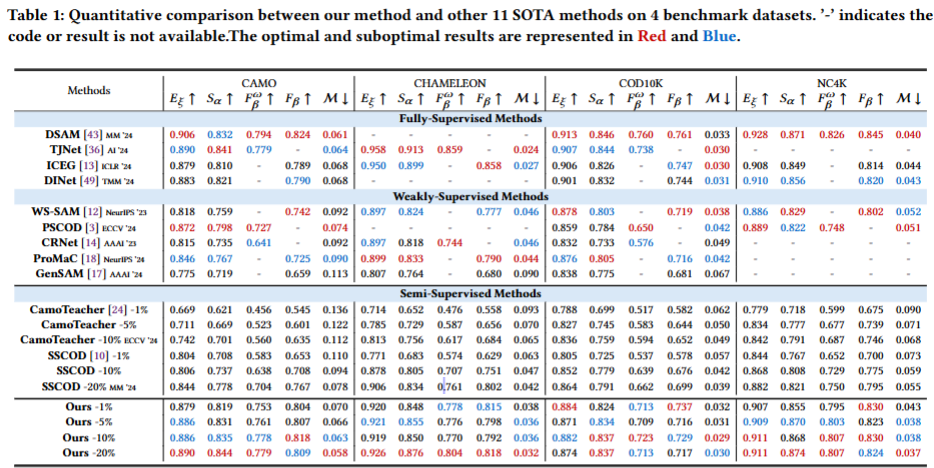
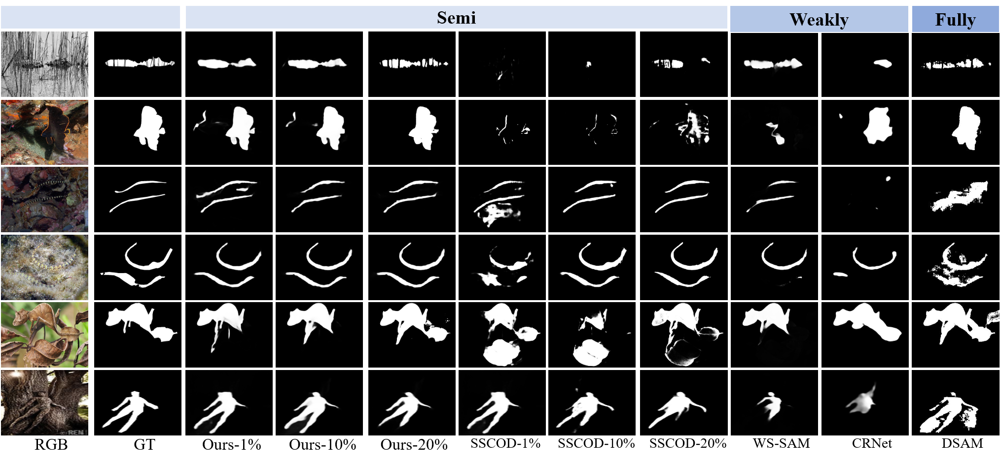

# ST-SAM
# **[ACM MM25] ST-SAM: SAM-Driven Self-Training Framework for Semi-Supervised Camouflaged Object Detection**

## ST-SAM
Semi-supervised Camouflaged Object Detection (SSCOD) aims to reduce reliance on costly pixel-level annotations by leveraging limited annotated data and abundant unlabeled data. However, existing SSCOD methods based on Teacher-Student frameworks suffer from severe prediction bias and error propagation under scarce supervision, while their multi-network architectures incur high computational overhead and limited scalability. To overcome these limitations, we propose ST-SAM, a highly annotation-efficient yet concise framework that breaks away from conventional SSCOD constraints. Specifically, ST-SAM employs Self-Training strategy that dynamically filters and expands high-confidence pseudo-labels to enhance a single-model architecture, thereby fundamentally circumventing inter-model prediction bias. Furthermore, by transforming pseudo-labels into hybrid prompts containing domain-specific knowledge, ST-SAM effectively harnesses the Segment Anything Model's potential for specialized tasks to mitigate error accumulation in self-training. Experiments on COD benchmark datasets demonstrate that ST-SAM achieves state-of-the-art performance with only 1\% labeled data, outperforming existing SSCOD methods and even matching fully supervised methods. Remarkably, ST-SAM requires training only a single network, without relying on specific models or loss functions. This work establishes a new paradigm for annotation-efficient SSCOD.

## Framework Architecture

## Performance:

### Prerequisites
- Python 3.9
- Pytorch 2.5.1
- Torchvision 0.8.2
- Numpy 1.26.3

### Datasets
- [Training and Test Sets](https://drive.google.com/drive/folders/1nHD-d3FanT6-ORsZTEeGgGzQ2CUKyWSe).

### Evaluation
Thanks to the project of (https://github.com/jiwei0921/Saliency-Evaluation-Toolbox)

### Contact
Feel free to send e-mails to me (1558239392@qq.com).

### Acknowledgements
The codes and datasets are based on [Noisy-COD](https://github.com/zhangjinCV/Noisy-COD) and [SAM](https://github.com/facebookresearch/segment-anything). Please also follow their licenses. Thanks for the awesome works.

