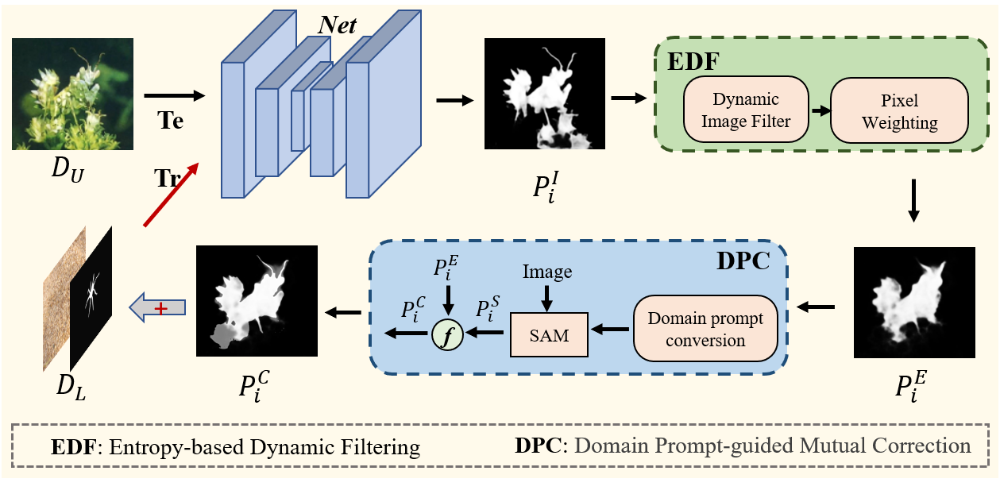

# ST-SAM
# **[ACM MM25] ST-SAM: SAM-Driven Self-Training Framework for Semi-Supervised Camouflaged Object Detection**

## ST-SAM
Semi-supervised Camouflaged Object Detection (SSCOD) aims to reduce reliance on costly pixel-level annotations by leveraging limited annotated data and abundant unlabeled data. However, existing SSCOD methods based on Teacher-Student frameworks suffer from severe prediction bias and error propagation under scarce supervision, while their multi-network architectures incur high computational overhead and limited scalability. To overcome these limitations, we propose ST-SAM, a highly annotation-efficient yet concise framework that breaks away from conventional SSCOD constraints. Specifically, ST-SAM employs Self-Training strategy that dynamically filters and expands high-confidence pseudo-labels to enhance a single-model architecture, thereby fundamentally circumventing inter-model prediction bias. Furthermore, by transforming pseudo-labels into hybrid prompts containing domain-specific knowledge, ST-SAM effectively harnesses the Segment Anything Model's potential for specialized tasks to mitigate error accumulation in self-training. Experiments on COD benchmark datasets demonstrate that ST-SAM achieves state-of-the-art performance with only 1\% labeled data, outperforming existing SSCOD methods and even matching fully supervised methods. Remarkably, ST-SAM requires training only a single network, without relying on specific models or loss functions. This work establishes a new paradigm for annotation-efficient SSCOD.

## Framework Architecture


## Quantitative Evaluation Results and  Qualitative Evaluation Results:


### Prerequisites
- Python 3.6
- Pytorch 1.10.2
- Torchvision 0.11.3
- Numpy 1.19.2

### Pretrained Model
Download the following `pth` and put it into main folder
- [SMT-t](https://pan.baidu.com/s/10c9efvi9eXl-7YLsoPvYTQ) with the fetch code:1234.

### Datasets
- [Datasets](https://pan.baidu.com/s/1V9VEMN5RChGvl42nU6FhSA) with the fetch code:1234.

### Results
You can download the tested results map at - [Baidu Pan link](https://pan.baidu.com/s/1TpYsv101RmmTVBARTFEugw) with the fetch code:1234.

You can download the results pth - [Baidu Pan link](https://pan.baidu.com/s/1baBE1ezwIwTzrH4KSitV3w) with the fetch code:1234.

### Evaluation
Thanks to the project of (https://github.com/jiwei0921/Saliency-Evaluation-Toolbox)

### Contact
Feel free to send e-mails to me (1558239392@qq.com).

### Citation
```
@ARTICLE{10379651,
  author={Hu, Xihang and Zhang, Xiaoli and Wang, Fasheng and Sun, Jing and Sun, Fuming},
  journal={IEEE Transactions on Circuits and Systems for Video Technology}, 
  title={Efficient Camouflaged Object Detection Network Based on Global Localization Perception and Local Guidance Refinement}, 
  year={2024},
  volume={34},
  number={7},
  pages={5452-5465},
  keywords={Transformers;Feature extraction;Task analysis;Object detection;Location awareness;Computational modeling;Sun;Camouflaged object detection;segmentation;attention perceptron},
  doi={10.1109/TCSVT.2023.3349209}}

```
